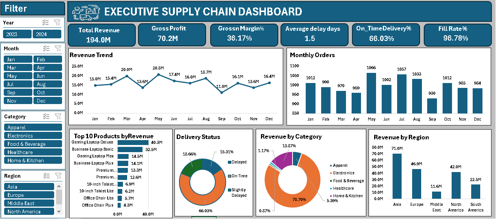
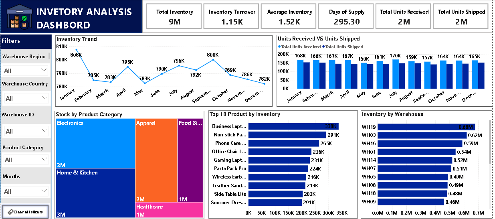
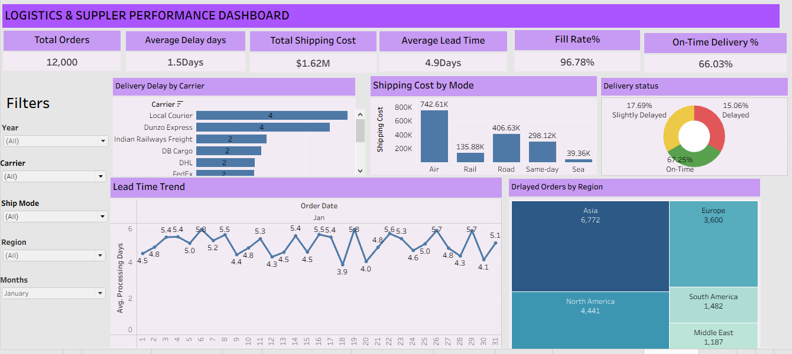
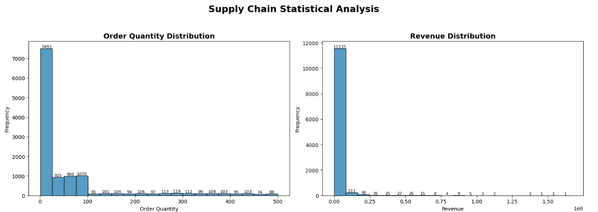
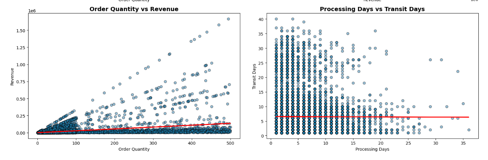
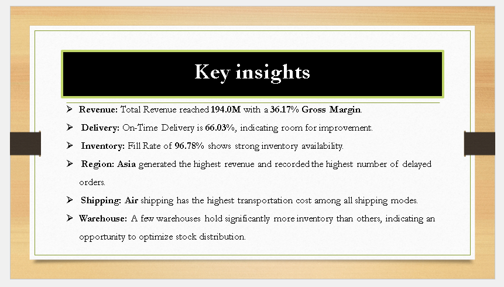
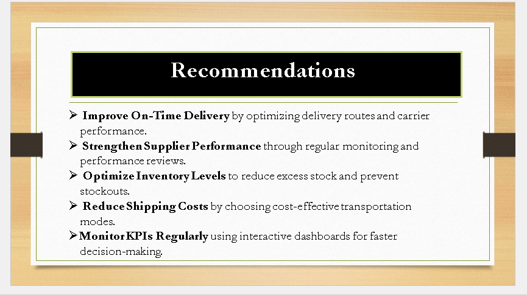

# Supply Chain Data Analytics Project

---

## 📌 Project Overview

This Supply Chain Data Analytics project provides an end-to-end analysis of supply chain performance, inventory management, logistics, supplier performance, and business operations.

The project uses **Power BI, Python, Excel, and SQL** to transform supply chain data into meaningful business insights and interactive dashboards.

---

## 🎯 Business Objectives

- Analyze overall supply chain performance
- Monitor revenue and profitability
- Analyze inventory levels and inventory turnover
- Evaluate delivery and logistics performance
- Identify delayed orders and delivery issues
- Analyze supplier and carrier performance
- Monitor shipping costs and lead times
- Analyze regional performance
- Identify top-performing products
- Perform statistical analysis using Python
- Generate business insights and recommendations

---

## 🛠️ Tools & Technologies

- Power BI
- DAX
- Microsoft Excel
- SQL / MySQL
- Python
- Pandas
- NumPy
- Matplotlib

---

# 📊 Dashboards & Analysis

## 1. Executive Supply Chain Dashboard

The Executive Supply Chain Dashboard analyzes:

- Total Revenue
- Gross Profit
- Gross Margin %
- Average Delay Days
- On-Time Delivery %
- Fill Rate %
- Revenue Trend
- Monthly Orders
- Top 10 Products by Revenue
- Delivery Status
- Revenue by Category
- Revenue by Region

### Dashboard Preview



---

## 2. Inventory Analysis Dashboard

The Inventory Analysis Dashboard analyzes:

- Total Inventory
- Inventory Turnover
- Average Inventory
- Days of Supply
- Total Units Received
- Total Units Shipped
- Inventory Trend
- Stock by Product Category
- Top 10 Products by Inventory
- Inventory by Warehouse

### Dashboard Preview



---

## 3. Logistics & Supplier Performance Dashboard

The dashboard analyzes:

- Total Orders
- Average Delay Days
- Total Shipping Cost
- Average Lead Time
- Fill Rate %
- On-Time Delivery %
- Delivery Delay by Carrier
- Shipping Cost by Mode
- Delivery Status
- Lead Time Trend
- Delayed Orders by Region

### Dashboard Preview



---

## 4. Python Statistical Analysis

Python was used for exploratory and statistical analysis.

### Analysis Includes

- Order Quantity Distribution
- Revenue Distribution
- Order Quantity vs Revenue
- Processing Days vs Transit Days

### Statistical Analysis



### Relationship Analysis



---

# 🔍 Key Insights

The analysis identifies important supply chain trends related to revenue, delivery, inventory, logistics, and regional performance.

### Key Insights



---

# 💡 Recommendations

The project provides recommendations to improve:

- On-Time Delivery
- Supplier Performance
- Inventory Optimization
- Shipping Cost Management
- Supply Chain KPI Monitoring

### Recommendations



---

# 📈 Key KPIs

- Total Revenue
- Gross Profit
- Gross Margin %
- Total Orders
- Average Delay Days
- On-Time Delivery %
- Fill Rate %
- Inventory Turnover
- Average Inventory
- Days of Supply
- Total Shipping Cost
- Average Lead Time

---

# 🔄 Project Workflow

**Raw Data → Data Cleaning → SQL Analysis → Python Statistical Analysis → Power BI Dashboard → Business Insights → Recommendations**

---

# 📁 Project Structure

```text
supply-chain-data-analytics/
│
├── README.md
│
├── Supply_Chain_Dashboard.pbix
├── Supply_Chain_Data.xlsx
├── Supply_Chain_Analysis.sql
├── Supply_Chain_Statistical_Analysis.html
│
├── Executive_Supply_Chain.png
├── Inventory_Analysis.png
├── Logistics_Supplier_Performance.png
├── Supply_Chain_Statistical_Analysis.png
├── Supply_Chain_Statistical_Analysis_2.png
├── Key_Insights.png
└── Recommendations.png
```

---

# 💡 Skills Demonstrated

- Data Cleaning
- Data Transformation
- SQL Analysis
- Exploratory Data Analysis
- Statistical Analysis
- Python Data Analysis
- Power BI Dashboard Development
- DAX
- KPI Development
- Inventory Analytics
- Logistics Analytics
- Supplier Performance Analysis
- Data Visualization
- Business Insights
- Business Recommendations

---

# 👨‍💻 Project Type

**Supply Chain Data Analytics**

---

# 📌 Author

**Your Name**
